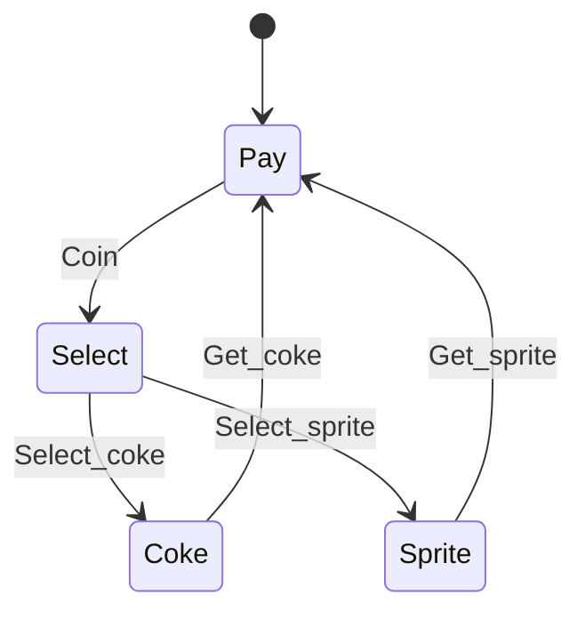
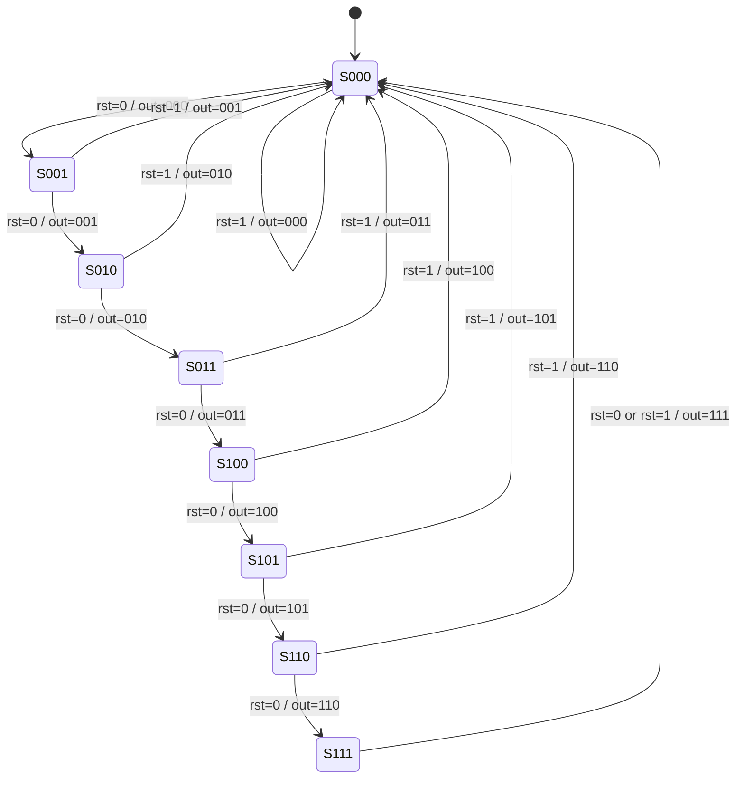

# Lec10_Transition Systems_Notes

> AI 整理。

## 零、本讲概述

### 1.本讲总览

这一讲的核心是 **Transition System（TS，转换系统）**。它是一种扩展有向图，用来形式化描述系统“有哪些状态、如何一步步变化、从哪里开始、每个状态满足什么性质”。

整节课可以按下面这条线理解：

1. **Transition System 的定义**：状态、动作、转移、初始状态、原子命题、标记函数。
2. **Transition System 的行为**：execution fragment、maximal、initial、execution、reachable state。
3. **硬件系统建模**：顺序电路、寄存器状态、输入动作、Mealy/Moore machine。
4. **软件系统建模**：typed variables、evaluations、conditions、effect function、program graph。
5. **等价验证**：构造两个 TS 的 product system，检查输出不同的 bad states 是否可达。
6. **工具链**：Verilog 经 Yosys 生成 BLIF，再由 SIS 转为 KISS；或由 Yosys 生成 SMT-LIB，交给 SMT Solver。

------

## 一、转换系统的定义

### 1.Transition System 是什么

Transition System 可以看作一个语义模型：

```text
Real system
   ↓ semantics abstraction
Transition system
   ↓ formal reasoning / model checking
Properties / requirements
```

它要刻画的信息包括：

- 系统有哪些状态；
- 系统每一步如何从一个状态转移到另一个状态；
- 系统从哪些初始状态开始；
- 每个状态满足哪些性质；
- 转移过程中发生了什么动作。

普通有向图只有节点和边，而 TS 额外带有动作、初始状态、原子命题和状态标记，因此更适合描述真实系统行为。

------

### 2.Transition System 的形式化定义

一个 Transition System 是六元组：

$$
T=(S,Act,\rightarrow,S_0,AP,L)
$$

其中：

| 符号 | 名称 | 含义 |
|---|---|---|
| $S$ | state space | 状态空间，系统所有可能状态的集合 |
| $Act$ | actions | 动作集合 |
| $\rightarrow$ | transition relation | 转移关系， $\rightarrow\subseteq S\times Act\times S$ |
| $S_0$ | initial states | 初始状态集合， $S_0\subseteq S$ |
| $AP$ | atomic propositions | 原子命题集合，用来描述状态性质 |
| $L$ | labeling function | 标记函数， $L:S\to 2^{AP}$ |

转移可以写成：

$$
s\xrightarrow{\alpha}s'
$$

表示系统在状态 $s$ 下执行动作 $\alpha$，然后进入状态 $s'$。

也可以写成三元组：

$$
(s,\alpha,s')\in\rightarrow
$$

#### 2.1 状态 $S$

状态描述系统在某一时刻的完整情况。例如：

- 饮料机中的 `Pay`、`Select`、`Coke`、`Sprite`；
- 时序电路中所有寄存器的当前值；
- 程序中当前代码位置 + 变量当前取值；
- 协议系统中每个进程的局部状态和通信缓冲区状态。

#### 2.2 动作 $Act$

动作描述系统状态变化的触发事件。例如：

- 饮料机中 `Coin`、`Select_coke`、`Get_coke`；
- 电路中“一次带有输入取值的 clock”；
- 程序中执行一条赋值语句；
- 并发系统中某个线程执行一步。

#### 2.3 原子命题 $AP$ 与标记函数 $L$

原子命题描述某个状态满足的性质。例如：

- `Pay`：当前正在等待付款；
- `Drink`：当前可以取饮料；
- `Error`：当前处于错误状态；
- `Done`：任务完成；
- `cnt_zero`：计数器值为 0。

标记函数：

$$
L:S\to 2^{AP}
$$

表示每个状态满足哪些原子命题。

例如：

$$
L(Coke)=\{Drink\}
$$

表示 `Coke` 状态满足 `Drink`。

------

### 3.饮料机 Transition System 示例

beverage machine 有四个状态：

$$
S=\{Pay,Select,Coke,Sprite\}
$$

初始状态：

$$
S_0=\{Pay\}
$$

动作集合：

$$
Act=\{Coin,Select\_coke,Select\_sprite,Get\_coke,Get\_sprite\}
$$

转移关系：

$$
Pay\xrightarrow{Coin}Select
$$

$$
Select\xrightarrow{Select\_coke}Coke
$$

$$
Select\xrightarrow{Select\_sprite}Sprite
$$

$$
Coke\xrightarrow{Get\_coke}Pay
$$

$$
Sprite\xrightarrow{Get\_sprite}Pay
$$

原子命题：

$$
AP=\{Pay,Drink\}
$$

标记函数：

$$
L(Pay)=\{Pay\}
$$

$$
L(Coke)=L(Sprite)=\{Drink\}
$$

$$
L(Select)=\emptyset
$$

另一种标记方式是： $AP=S$，且 $L(s)=\{s\}$。两种标记方式关注的状态性质不同，不能混为一套定义。

图示：



理解：在 `Pay` 状态投币后进入选择状态；选择饮料后进入对应饮料状态；取走饮料后回到付款状态。

------

### 4.并行动作：Independent 与 Dependent

用：

$$
\alpha_1\parallel\alpha_2
$$

表示两个动作并行执行。

并行动作分两类：

| 类型 | 条件 | 行为特点 |
|---|---|---|
| independent actions | 两个动作访问不同变量 | 不同执行顺序结果相同，可用 interleaving 理解 |
| dependent actions | 两个动作访问同一变量或存在读写依赖 | 不同执行顺序可能导致不同结果，出现 competition |

#### 4.1 Independent actions：Interleaving

例子：

$$
x:=x+1\parallel y:=y-3
$$

初始：

$$
x=0,y=5
$$

两个动作互不影响，因此无论顺序如何，最终都得到：

$$
x=1,y=2
$$

执行图：

```text
(x=0,y=5)
   ├── x:=x+1 → (x=1,y=5) ── y:=y-3 → (x=1,y=2)
   └── y:=y-3 → (x=0,y=2) ── x:=x+1 → (x=1,y=2)
```

#### 4.2 Dependent actions：Competition

例子：

$$
x:=x+1\parallel y:=2x
$$

初始：

$$
x=0,y=0
$$

如果先执行 $y:=2x$：

$$
y=0
$$

再执行 $x:=x+1$：

$$
x=1,y=0
$$

如果先执行 $x:=x+1$：

$$
x=1
$$

再执行 $y:=2x$：

$$
y=2
$$

最终可能是：

$$
(x=1,y=0)
$$

也可能是：

$$
(x=1,y=2)
$$

这说明依赖动作会引入非确定性。

------

### 5.Direct Predecessors 与 Direct Successors

给定状态 $s$ 和动作 $\alpha$。

#### 5.1 Direct $\alpha$-predecessors

$$
Pre_\alpha(s)=\{s'\in S\mid s'\xrightarrow{\alpha}s\}
$$

意思是：哪些状态可以通过动作 $\alpha$ 一步到达 $s$。

#### 5.2 Direct predecessors

不指定动作时：

$$
Pre(s)=\bigcup_{\alpha\in Act}Pre_\alpha(s)
$$

即所有能一步到达 $s$ 的状态。

#### 5.3 Direct $\alpha$-successors

$$
Post_\alpha(s)=\{s'\in S\mid s\xrightarrow{\alpha}s'\}
$$

意思是：从 $s$ 执行动作 $\alpha$ 可以一步到达哪些状态。

#### 5.4 Direct successors

$$
Post(s)=\bigcup_{\alpha\in Act}Post_\alpha(s)
$$

即从 $s$ 出发一步可达的所有状态。

#### 5.5 记忆方法

- `Pre`：谁能到我；
- `Post`：我能到谁；
- 带 $\alpha$：只看某个动作；
- 不带 $\alpha$：所有动作都考虑。

------

### 6.Terminal State

一个状态 $s$ 是 terminal，当且仅当：

$$
Post(s)=\emptyset
$$

也就是说，从 $s$ 没有任何后继状态。

如果：

$$
Post(s)\neq\emptyset
$$

则 $s$ 是 non-terminal。

注意：如果一个状态有自环 $s\to s$，它不是 terminal，因为它仍然有 successor。

------

## 二、转换系统的行为

### 1.Transition System 的行为

TS 的行为可以用下面伪代码理解：

```text
select nondeterministically an initial state s ∈ S_0
while s is non-terminal do
    select nondeterministically a transition s --α--> s'
    execute action α
    s := s'
end while
```

这里有两层非确定性：

1. 初始状态可能有多个；
2. 当前状态可能有多条可选转移。

因此 TS 描述的是系统所有可能行为的集合。

------

### 2.Execution Fragment

#### 2.1 有限 execution fragment

一个有限 execution fragment 形如：

$$
\rho=s_0\alpha_1s_1\alpha_2s_2\cdots \alpha_ns_n
$$

并满足每一步都是合法转移：

$$
s_{i-1}\xrightarrow{\alpha_i}s_i
$$

#### 2.2 无限 execution fragment

一个无限 execution fragment 形如：

$$
\rho=s_0\alpha_1s_1\alpha_2s_2\alpha_3s_3\cdots
$$

同样要求每一步合法。

#### 2.3 关键点

execution fragment 不要求从初始状态开始，也不要求走到 terminal state。它只是一段合法路径。

------

### 3.Initial、Maximal 与 Execution

#### 3.1 Initial fragment

如果 execution fragment 的第一个状态属于初始状态集合：

$$
s_0\in S_0
$$

则它是 initial。

#### 3.2 Maximal fragment

一个 fragment 是 maximal，如果满足以下二者之一：

1. 它是有限路径，并且最后状态是 terminal；
2. 它是无限路径。

有限路径 maximal 的条件：

$$
Post(s_n)=\emptyset
$$

#### 3.3 Execution

定义：

也就是 execution 必须同时满足：

1. 从初始状态开始；
2. 要么无限执行，要么执行到 terminal state 才停。

对比表：

| 类型 | 要求从初始状态开始 | 要求 maximal |
|---|---:|---:|
| execution fragment | 否 | 否 |
| initial fragment | 是 | 否 |
| maximal fragment | 否 | 是 |
| execution | 是 | 是 |

------

### 4.Reachable State

状态 $s$ 是 reachable，如果存在一条从初始状态开始的有限合法路径到达它：

$$
s_0\alpha_1s_1\cdots\alpha_ns_n
$$

其中：

$$
s_0\in S_0,
\quad s_n=s
$$

所有可达状态组成集合：

$$
Reach(TS)
$$

或简称：

$$
Reach
$$

#### 4.1 为什么可达性重要

大量验证问题都可以转化为可达性问题：

- 是否可能到达错误状态？
- 是否可能死锁？
- 两个电路是否可能输出不一致？
- 某个寄存器组合是否永远不会出现？
- 程序是否可能进入异常分支？

------

### 5.Model Checking 的基本框架

模型检查的整体流程是：

```text
System η
   ↓ modeled as
Transition System TS
   ↓ checked by
Model Checker
   ↑
Specification φ
```

问题是：

$$
TS\models \varphi ?
$$

如果满足，输出 yes。  
如果不满足，输出 no，并给出 error indication / counterexample。

#### 5.1 仿真与模型检查的区别

| 方法 | 特点 | 局限 |
|---|---|---|
| Simulation | 给定输入样例，观察输出 | 只能覆盖有限测试 |
| Model Checking | 穷尽检查系统所有可能行为 | 状态空间可能爆炸 |

------

## 三、顺序电路建模

### 1.顺序电路的数学抽象

顺序电路包含：

- input bits；
- registers；
- output bits；
- combinational logic。

组合逻辑根据当前输入和当前寄存器值计算：

1. 当前输出；
2. 下一拍寄存器值。

形式化写成：

$$
y=g(x,r)
$$

$$
r'=f(x,r)
$$

其中：

- $x$：输入；
- $r$：当前寄存器值；
- $y$：输出；
- $r'$：下一状态寄存器值。

------

### 2.顺序电路转换为 TS

#### 2.1 状态

状态是寄存器取值 evaluation。

如果有 $n$ 个寄存器 bit，则状态数最多为：

$$
2^n
$$

#### 2.2 动作

动作代表一次 clock，并携带输入 bits 的取值。

如果输入有 $m$ bit，则动作数最多为：

$$
2^m
$$

#### 2.3 初始状态

由 initial register evaluation 决定。

例如初始寄存器值为 0，则：

$$
S_0=\{0\}
$$

#### 2.4 转移

对于每个当前状态 $r$ 和输入 $x$：

$$
r'=f(x,r)
$$

于是有转移：

$$
r\xrightarrow{x}r'
$$

------

### 3.状态数计算例题

例题：

答案：

$$
2^{200}
$$

原因：TS 的状态由寄存器取值决定，而不是由 gate 数或 output bit 数决定。

总结：

$$
\#states=2^{\#register\ bits}
$$

- gates 数影响转移函数复杂度；
- output bits 影响输出函数宽度；
- input bits 影响动作数量；
- register bits 决定状态数量。

------

### 4.Mealy Machine 与 Moore Machine

#### 4.1 Mealy Machine

Mealy machine 的输出依赖当前状态和当前输入：

$$
y=g(state,input)
$$

对应顺序电路中：

$$
y=g(r,x)
$$

上面的电路模型属于 Mealy machine，因为输出函数依赖 input 和 register state。

#### 4.2 Moore Machine

Moore machine 的输出只依赖当前状态：

$$
y=g(state)
$$

也就是：

$$
y=g(r)
$$

输入只影响下一状态，不直接影响当前输出。

#### 4.3 对比

| 类型 | 输出依赖 | 特点 |
|---|---|---|
| Mealy | state + input | 输出可能随当前输入立即变化 |
| Moore | state only | 输出函数只依赖当前状态 |

判断时不要只看有没有寄存器，而要看输出函数是否直接依赖输入。

------

## 四、Program Graph

### 1.为什么程序建模需要数据状态

程序中常有条件分支：

```text
if condition then ...
while condition do ...
```

下一步走哪条边取决于变量当前取值。所以状态不能只包含程序位置，还必须包含变量取值。

因此：

$$
state=(location, variable\ evaluation)
$$

------

### 2.Typed Variables

typed variable = 变量名 + 数据定义域。

例子：

- Boolean variable：

$$
x:\{true,false\}
$$

- Integer variable：

$$
y:\mathbb{N}
$$

- 枚举变量：

$$
color:\{yellow,red,blue\}
$$

具体动作的变量定义域须与运算结果相容。变量的 domain 决定 evaluation 的可能数量，也决定 TS 状态空间大小。

------

### 3.Evaluation

对于变量集合 $Var$，一个 evaluation 是一个 type-consistent function：

$$
\eta:Var\to \bigcup_{x\in Var}Dom(x)
$$

并且满足：

$$
\eta(x)\in Dom(x)
$$

所有合法 evaluation 的集合记为：

$$
Eval(Var)
$$

例子：

若：

$$
Var=\{x:\mathbb{Z},flag:\mathbb{B},color:\{yellow,red,blue\}\}
$$

一个合法 evaluation 是：

$$
\eta(x)=3,\quad \eta(flag)=true,\quad \eta(color)=red
$$

------

### 4.Conditions 与 Satisfaction

$Cond(Var)$ 表示关于变量集合 $Var$ 的布尔条件集合。

例子：

$$
x>0
$$

$$
color=red
$$

$$
x+y\le 10
$$

用：

$$
\eta\models g
$$

表示 evaluation $\eta$ 满足条件 $g$。

例如如果 $\eta(x)=5$，那么：

$$
\eta\models x>0
$$

------

### 5.Effect Function

动作对变量的影响用 effect function 表示：

$$
Effect:Act\times Eval(Var)\to Eval(Var)
$$

也就是：

$$
Effect(\alpha,\eta)=\eta'
$$

表示在变量取值 $\eta$ 下执行动作 $\alpha$，得到新取值 $\eta'$。

例子：动作 $x:=x+1$，当前 $\eta(x)=3$，则：

$$
Effect(x:=x+1,\eta)(x)=4
$$

其他变量保持不变。

**顺序赋值与同时赋值：** 设初始 $x=2,y=2$，此例变量取整数：

- 顺序执行 $x:=2x+y;\ y:=10-2x$，第二条语句使用更新后的 $x=6$，得到 $x=6,y=-2$。
- 同时赋值 $x,y:=2x+y,10-2x$，两个右侧表达式都使用旧值，得到 $x=6,y=6$。

------

### 6.Program Graph 定义

Program Graph over $Var$ 是一个元组：

$$
PG=(Loc,Act,Effect,\hookrightarrow,Loc_0,g_0)
$$

其中：

| 符号 | 含义 |
|---|---|
| $Loc$ | 有限 location 集合 |
| $Act$ | 动作集合 |
| $Effect$ | 动作对变量 evaluation 的影响 |
| $\hookrightarrow$ | 条件转移关系， $\hookrightarrow\subseteq Loc\times Cond(Var)\times Act\times Loc$ |
| $Loc_0$ | 初始 location 集合 |
| $g_0$ | 初始变量条件 |

Program Graph 的边写作：

$$
\ell\xrightarrow{g:\alpha}\ell'
$$

含义：如果当前处于 location $\ell$，并且当前变量取值满足 guard $g$，则可以执行动作 $\alpha$，然后进入 $\ell'$。

其中：

- $g$ 是 guard / condition；
- $\alpha$ 是 action；
- $\ell,\ell'$ 是 location。

------

### 7.Program Graph 到 Transition System 的语义

Program Graph $PG$ 的 TS 记作：

$$
TS(PG)
$$

#### 7.1 状态空间

状态由 location 和 evaluation 组成：

$$
S=Loc\times Eval(Var)
$$

状态写成：

$$
\langle \ell,\eta\rangle
$$

#### 7.2 初始状态

$$
S_0=\{\langle \ell,\eta\rangle\mid \ell\in Loc_0\land \eta\models g_0\}
$$

即初始 location 合法，并且变量取值满足初始条件。

#### 7.3 转移规则

如果 Program Graph 有边：

$$
\ell\xrightarrow{g:\alpha}\ell'
$$

当前 evaluation 满足：

$$
\eta\models g
$$

动作执行后：

$$
\eta'=Effect(\alpha,\eta)
$$

则 TS 中有：

$$
\langle \ell,\eta\rangle\xrightarrow{\alpha}\langle \ell',\eta'\rangle
$$

------

**例子：** 初始 $x=2,y=0$，执行循环“当 $x>0$ 时先令 $x:=x-1$，再令 $y:=y+1$”，对应状态序列为：

$$
\langle l_1, 2, 0 \rangle
\to \langle l_2, 1, 0 \rangle
\to \langle l_1, 1, 1 \rangle
\to \langle l_2, 0, 1 \rangle
\to \langle l_1, 0, 2 \rangle
\to \langle l_3, 0, 2 \rangle
$$

这里三元组依次表示 location、 $x$、 $y$。如果要精确表示这一个初始赋值，应取 $g_0=(x=2\land y=0)$；仅有 $x>0$ 不能确定全部初始值。

------

### 8.Structured Operational Semantics（SOS）

SOS 记号：

$$
\frac{premise}{conclusion}
$$

意思是：如果上面的 premise 成立，则下面的 conclusion 成立。

Program Graph 的转移语义可写成：

$$
\frac{\ell\xrightarrow{g:\alpha}\ell'\quad \eta\models g\quad \eta'=Effect(\alpha,\eta)}
{\langle \ell,\eta\rangle\xrightarrow{\alpha}\langle \ell',\eta'\rangle}
$$

这是把程序控制流和变量更新转化为 TS 转移的核心规则。

------

### 9.Program Graph 的 Atomic Propositions 和 Labeling

$AP=Loc\cup Cond(Var)$。Program Graph 转成 TS 后，原子命题包括：

1. location 本身；
2. 关于变量的条件。

状态：

$$
\langle \ell,\eta\rangle
$$

通常满足 location 命题 $\ell$，也满足所有在 $\eta$ 下为真的变量条件。

可以写成：

$$
L(\langle \ell,\eta\rangle)=\{\ell\}\cup\{g\in Cond(Var)\mid \eta\models g\}
$$

------

## 五、顺序电路等价性检查

### 1.问题定义

给定两个顺序电路，判断它们是否等价。

对顺序电路来说，等价不仅是某一拍输出相同，而是要求：

为简化讨论，假设电路都是 Moore machine。

------

### 2.用 TS 表示两个电路

对于每个 TS：

- 状态：寄存器取值；
- 动作：clock with input bits；
- 输出：由状态决定。

记号：

| 对象 | 例子 |
|---|---|
| 状态 | $P,Q,R,S,T$ |
| 输入动作 | $a,b$ |
| 输出 | $X,Y$ |

------

### 3.Product Transition System

为了比较两个 TS，需要构造 product TS。

若两个系统为 $TS_1$ 和 $TS_2$，则 product state 是状态对：

$$
(s_1,s_2)\in S_1\times S_2
$$

把 $(P,R)$ 写成 `PR`， $(Q,T)$ 写成 `QT`。

初始状态也必须配对。对于两个给定初始状态的电路，product 的初始状态就是这两个状态组成的状态对。若分别给出初始状态集合，则这里按 $S_{0,prod}=S_{0,1}\times S_{0,2}$ 比较所有初始组合。

下面的等价判断限定在本节的确定性 Moore 电路模型、相同输入序列和上述初始状态约定下，不直接推广为任意非确定 TS 的等价定义。

#### 3.1 Product transition

只有两个系统使用相同输入动作时，才能组成 product transition。

如果：

$$
s_1\xrightarrow{a}s_1'
$$

且：

$$
s_2\xrightarrow{a}s_2'
$$

则：

$$
(s_1,s_2)\xrightarrow{a}(s_1',s_2')
$$

如果一个动作是 $a$，另一个是 $b$，则不能配对。

原因：等价验证比较的是相同输入序列下的输出行为。

------

### 4.Bad State

在 product TS 中，如果两个分量状态的输出不同，则该 product state 是 bad state。

形式化：

$$
Bad=\{(s_1,s_2)\mid output_1(s_1)\neq output_2(s_2)\}
$$

例如：

- 输出对 `XX`：不是 bad；
- 输出对 `YY`：不是 bad；
- 输出对 `XY`：bad；
- 输出对 `YX`：bad。

#### 4.1 等价条件

两个系统等价，当且仅当 bad states 不可达：

$$
Reach(TS_{prod})\cap Bad=\emptyset
$$

如果存在可达 bad state，则两个系统不等价。

从初始 product state 到 bad state 的路径就是 counterexample，其动作序列就是导致输出不一致的输入序列。

------

### 5.顺序电路等价验证流程

```text
1. Build TS1 for circuit 1
2. Build TS2 for circuit 2
3. Construct product TS = TS1 × TS2
4. Mark bad states where outputs differ
5. Compute reachable states of product TS
6. If any bad state is reachable: not equivalent
7. Otherwise: equivalent
```

伪代码：

```text
Bad = {(s1,s2) | out1(s1) != out2(s2)}
Reach = reachable_states(product_TS)

if Reach ∩ Bad ≠ ∅:
    return not equivalent, counterexample
else:
    return equivalent
```

#### 5.1 状态空间爆炸

如果两个系统状态数分别为 $N_1$ 和 $N_2$，product TS 状态数最多为：

$$
N_1N_2
$$

如果两个电路分别有 $n_1$ 和 $n_2$ 个寄存器 bit，则：

$$
N_1=2^{n_1},\quad N_2=2^{n_2}
$$

product 状态数最多为：

$$
2^{n_1+n_2}
$$

这解释了为什么显式存储 product TS 通常不可行，也为什么后续需要 SAT / Model Checking 方法。

------

## 六、Yosys、SMT-LIB 与 KISS

### 1.Logic Synthesis 背景

Logic synthesis 是把高级硬件描述转换成 gate-level netlist 的过程。

输入：

```verilog
module Counter(
    input wire clk,
    output wire [2:0] cnt
);
...
endmodule
```

输出：门级网表。

常见工具：

| 类型 | 工具 |
|---|---|
| 商业工具 | Synopsys DC、Cadence Genus、Xilinx Vivado |
| 开源工具 | Yosys、ABC、SIS |

------

### 2.自动化流程

```text
Verilog
   ↓ Yosys
BLIF
   ↓ SIS
Transition System in KISS format
   ↓ Graphviz
TS Graph
```

另一条验证路线：

```text
Verilog
   ↓ Yosys
SMT-LIB
   ↓ SMT Solver
Verification
```

#### 2.1 BLIF

BLIF 是一种表示 gate-level netlist 的格式，可以表达数字逻辑电路结构。

#### 2.2 KISS

KISS 是有限状态机 / TS 的文本表示格式，包含输入数、输出数、状态数、初始状态和转移表。

#### 2.3 Graphviz

Graphviz 用于把 TS 可视化成图。

------

### 3.SMT-LIB 基本概念

SMT-LIB 是表示 SMT 问题的标准格式。它可以抽象表示顺序电路的：

- 状态类型；
- 输入信号；
- 寄存器信号；
- 初始状态条件；
- 转移函数；
- 验证性质。

#### 3.1 常见类型

| SMT-LIB 类型 | 含义 |
|---|---|
| `Int` | 整数 |
| `Bool` | 布尔 |
| `(_ BitVec n)` | n 位位向量 |
| `declare-sort` 命令 | 声明自定义类型，本身不是一个类型 |

#### 3.2 表达式

SMT-LIB 使用前缀形式：

```lisp
(<op> <expr1> <expr2> ...)
```

例子：

```lisp
(bvadd a #b001)
```

假设 `a` 为 3-bit 位向量，表示模 8 的加法 $a+1$。位向量常量必须写明位宽，不能把整数 `1` 直接当作位向量操作数。语法说明参见 [SMT-LIB 位向量定义](https://smt-lib.org/theories-FixedSizeBitVectors.shtml)。

```lisp
(ite flag (+ a 1) (- b 1))
```

此例假设 `flag` 为 Bool，`a,b` 为 Int，表示：

```text
flag ? a+1 : b-1
```

------

### 4.SMT-LIB 常见命令

#### 4.1 declare-sort

声明自定义类型：

```lisp
(declare-sort <symbol> <num>)
```

例子：

```lisp
(declare-sort state 0)
```

表示声明一个无参数类型 `state`。

#### 4.2 declare-fun

声明函数，但不定义具体行为：

```lisp
(declare-fun <symbol> (<sort>*) <sort>)
```

例子：

```lisp
(declare-fun eq_zero (Int) Bool)
(declare-fun add (Int Int) Int)
```

#### 4.3 define-fun

定义有明确逻辑的函数：

```lisp
(define-fun <symbol> ((<symbol> <sort>)*) <sort> <expr>)
```

例子：

```lisp
(define-fun max ((a Int) (b Int))
    Int
    (ite (> a b) a b))
```

------

### 5.3-bit Counter 示例

Verilog：

```verilog
module counter_3bit (
    input wire clk,
    input wire rst,
    output reg [2:0] count
);
    initial count = 0;
    always @(posedge clk) begin
        count <= rst ? 0 : count + 3'b001;
    end
endmodule
```

功能：

- 初始 `count=0`；
- 每个时钟上升沿：
  - 若 `rst=1`，`count<=0`；
  - 若 `rst=0`，`count<=count+1`；
- 由于 count 是 3-bit，所以按 modulo 8 计数。

------

### 6.3-bit Counter 的 SMT-LIB 解释

以下是包含位向量类型及递增函数的语义示例，不是工具原始输出的逐字复制。按一拍一步的抽象，`check_trans` 约束下一拍寄存器值，不再另行编码时钟边沿。

#### 6.1 状态类型

```lisp
(declare-sort |counter_3bit_s| 0)
```

声明全局状态类型。

#### 6.2 信号读取函数

```lisp
(declare-fun |get_clk| (|counter_3bit_s|) Bool)
(declare-fun |get_count| (|counter_3bit_s|) (_ BitVec 3))
(declare-fun |get_rst| (|counter_3bit_s|) Bool)
```

表示从状态中读取 `clk`、`count`、`rst`。

#### 6.3 下一状态函数

先定义递增函数：

```lisp
(define-fun |get_inc_count| ((state |counter_3bit_s|))
    (_ BitVec 3)
    (bvadd (|get_count| state) #b001))
```

```lisp
(define-fun |get_next_state| ((state |counter_3bit_s|))
    (_ BitVec 3)
    (ite (|get_rst| state) #b000 (|get_inc_count| state)))
```

对应：

$$
count'=\begin{cases}
0, & rst=1\\
count+1, & rst=0
\end{cases}
$$

#### 6.4 转移检查函数

```lisp
(define-fun |check_trans|
    ((state |counter_3bit_s|)
     (next_state |counter_3bit_s|))
    Bool
    (= (|get_next_state| state) (|get_count| next_state)))
```

表示 next_state 的 count 是否等于由当前 state 计算出的下一 count。

#### 6.5 初始状态检查

```lisp
(define-fun |check_init| ((state |counter_3bit_s|)) Bool
    (= (|get_count| state) #b000))
```

表示初始状态满足 `count=0`。

------

### 7.3-bit Counter 的 Transition System

状态集合：

$$
S=\{000,001,010,011,100,101,110,111\}
$$

初始状态：

$$
S_0=\{000\}
$$

输入动作：

$$
rst=0\quad \text{or}\quad rst=1
$$

转移函数：

$$
rst=1\Rightarrow count'=000
$$

$$
rst=0\Rightarrow count'=count+1\pmod 8
$$

输出：

$$
output=count
$$

------

### 8.KISS 格式解释

KISS 片段：

```text
.i 1
.o 3
.p 15
.s 8
.r 000
0 000 001 000
1 000 000 000
1 001 000 001
0 001 010 001
0 010 011 010
1 010 000 010
...
- 111 000 111
```

这里的 `...` 只是省略标记，不能直接放入完整 KISS 输入。末行合并了两种输入，因此 15 行记录覆盖 16 个“状态、输入”组合。

头部含义：

| 字段 | 含义 |
|---|---|
| `.i 1` | 1 个输入 bit |
| `.o 3` | 3 个输出 bit |
| `.p 15` | 15 行转移记录，其中 `-` 可覆盖多个输入取值 |
| `.s 8` | 8 个状态 |
| `.r 000` | 初始状态为 000 |

转移行格式：

```text
<input> <current_state> <next_state> <output>
```

例如：

```text
0 000 001 000
```

表示输入 `rst=0` 时，从状态 `000` 到 `001`，输出为 `000`。

`-` 表示任意输入。例如：

```text
- 111 000 111
```

表示当前状态为 `111` 时，无论 `rst=0` 还是 `rst=1`，下一状态都是 `000`，输出是 `111`。

------

### 9.3-bit Counter 的 Mermaid 图



------
