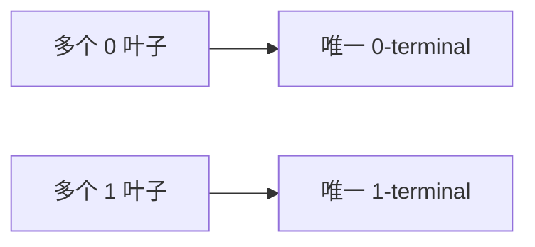
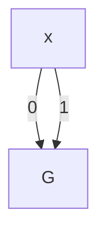
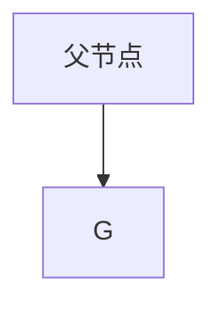
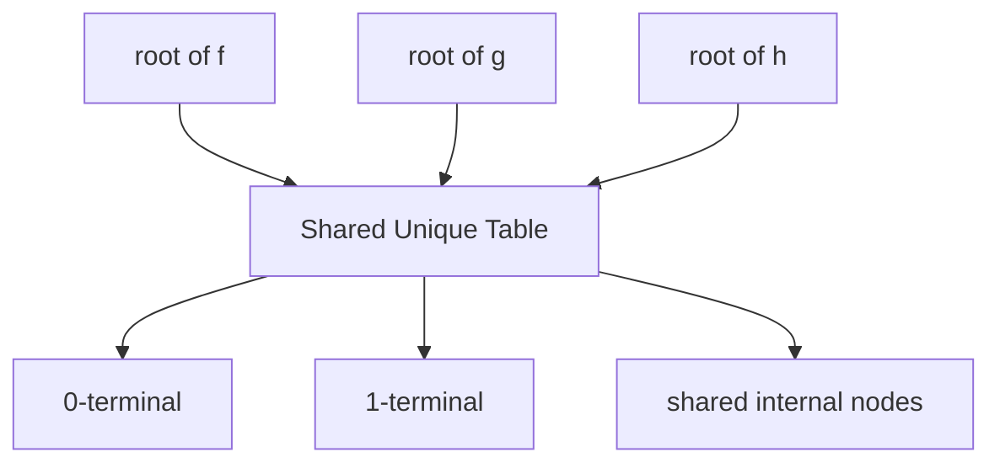

# Lec09_BDD_Notes

## 一、定义

### 1.BDT（Binary Decision Tree）

**BDT ，即二元决策树。** 对于一个布尔函数，从根节点开始，每层判断一个变量：

- 走 0 边：该变量取 0 / false；
- 走 1 边：该变量取 1 / true；
- 走到叶子：得到函数值 0 或 1。

如果有 $n$ 个变量，则一个完整 BDT 有 $2^n$​ 个叶子，对应完整真值表。

------

### 2.BDD(Binary Decision Diagram)

**BDD，即二元决策图。** 和 BDT 类似，它按照布尔变量的取值进行分支，但使用 **DAG**（有向无环图）表示，因此不同路径可以共享同一个子图。BDD 本身不一定已经约简，也不一定遵循固定的变量顺序；同时满足 Reduced 和 Ordered 两个性质的 BDD 才是 ROBDD。

一个 BDD 具有以下结构：

1. 有一个唯一的初始节点，即 root。
2. 非终端节点标有一个布尔变量。
3. 终端节点标有 0 或 1。
4. 每个非终端节点有两条出边：
   - 0-edge / low edge：变量取 0；
   - 1-edge / high edge：变量取 1。
5. 边指向后继节点或终端节点，不形成环。固定变量顺序是 OBDD / ROBDD 的额外性质。

可以把一个 BDD 节点理解成下面的条件表达式：

$$
F = \begin{cases}
F_{0}, & x=0 \\
F_{1}, & x=1
\end{cases}
$$

等价写成 Shannon 展开：

$$
F = \overline{x}F_{x=0} + xF_{x=1}
$$

------

### 3.ROBDD（Reduced Ordered Binary Decision Diagram）

**ROBDD，中文译作 “约简有序二元决策图” ，** 是布尔函数的规范表示。

#### 3.1 Ordered：变量顺序固定

- 设变量顺序为：

  ```math
  x_1 < x_2 < x_3 < \cdots < x_n
  ```

  一个 BDD 满足该 ordering，意思是：在任意一条从 root 到 terminal 的路径上，变量出现的顺序必须与预定义顺序一致。

- BDD 的规模对变量顺序敏感。

------

#### 3.2 Reduced：约简操作

##### 1：合并 0/1 终端节点

原始 BDT 中可能有很多 0 叶子和很多 1 叶子。约简时只保留一个 0-terminal 和一个 1-terminal：



这样，所有指向 0 的边都指向同一个 0-terminal，所有指向 1 的边都指向同一个 1-terminal。

---

##### 2：删除冗余的非终端节点

如果某个节点的 0 分支和 1 分支指向同一个子节点，那么这个变量对函数值没有影响，可以删掉该节点。

设节点为 $x$，low 和 high 都指向同一子图 $G$：

$$
F = \overline{x}G + xG = G(\overline{x}+x)=G
$$

因此该节点是冗余的。

图示：



约简后直接变为：



---

##### 3：合并重复的非终端节点

如果两个节点具有完全相同的三元组：

$$
(v, low, high)
$$

那么它们代表同一个布尔子函数，应当只保留一份。

------

#### 3.3 ROBDD 的规范性

**Bryant定理：** 对固定的变量顺序，一个布尔函数的ROBDD是唯一的。

**推论：**

- 如果两个布尔公式表示同一个函数，在相同变量顺序下构造 ROBDD，结果同构 ⇒ **可以用 ROBDD 做布尔函数等价性检查**。
- 在同一个 BDD manager / unique table 中，等价函数直接表现为同一个 root 指针。

------

## 二、ROBDD 的算法实现

### 1.节点三元组与唯一表

- 一个非终端 ROBDD 节点可以用**三元组**唯一表示： $(v,l,h)$ 。

  | 符号  |               含义                |
  | :---: | :-------------------------------: |
  | $v$ |        当前节点判断的变量         |
  | $l$ | low child，即变量取 0 时的子节点  |
  | $h$ | high child，即变量取 1 时的子节点 |

  为了让相同节点只存在一份，BDD 实现一般维护一个 **unique table**： $(v,l,h) \mapsto node\_id$ 。

- 代码实现：unique table 使用 map 实现，节点三元组使用 tuple 实现。

  ```c++
  #include <tuple>
  #include <map>

  map<tuple<int, int, int>, int> unique_table; // 声明唯一表

  tuple<int, int, int> key = make_tuple(var, low, high); // 创建map的key

  if (unique_table.count(key)) { // 检查key是否在唯一表中，存在则返回1，不存在则返回0
      // key存在时...
  }
  ```

- 通常对两个终端节点 0/1 进行特殊编号，例如：0_terminal 编号为 -2 ，1_terminal 编号为 -1 。

---

### 2.Reduce 操作

 常把 **“ Reduce ”和“查 unique table ”** 合成一个 `mk` 函数：

1. 如果`low == high` ，删除无用节点。
2. 如果 unique table 中已经存在三元组 $(v,l,h)$，返回已有节点编号。
3. 如果不存在，就新建节点并加入 unique table。

```c++
#include <iostream>
#include <vector>
#include <tuple>
#include <map>
using namespace std;

struct Node {
    int var;
    int low;
    int high;
};

vector<Node> nodes;

// unique_table[(var, low, high)] = node_id
map<tuple<int, int, int>, int> unique_table;

// 创建或者复用 BDD 节点
int mk(int var, int low, int high) {
    // 约简规则 2：如果 low 和 high 一样，说明这是一个冗余节点，直接删除
    if (low == high) {
        return low;
    }

    // 用三元组 (var, low, high) 作为 key
    tuple<int, int, int> key = make_tuple(var, low, high);

    // 约简规则 3：如果 unique_table 里已经有这个节点，直接复用
    if (unique_table.count(key)) {
        return unique_table[key];
    }

    // 否则新建节点
    int id = nodes.size();
    nodes.push_back({var, low, high});

    // 记录到 unique_table 中
    unique_table[key] = id;

    return id;
}
```

------

### 3.从 BDT 构造 ROBDD

#### 3.1 已有一棵完整的BDT：后序 DFS 约简

**思路：**

1. 从 root 开始 DFS。
2. 先递归处理 low child 和 high child。
3. 回溯到当前节点时：
   - 如果 low 和 high 相同，当前节点无用，直接返回 child；
   - 否则查 unique table：
     - 找到相同三元组则复用；
     - 找不到则新建。

**伪代码：**

```c++
reduce(node):
    if node is terminal:
        return terminal(node.value)

    low  = reduce(node.low)
    high = reduce(node.high)

    if low == high:
        return low

    return lookup(node.var, low, high)
```

从而把 BDT 中大量重复子树合并，得到 ROBDD。

------

#### 3.2 从布尔函数构造 ROBDD

- 直接建立完整 BDT 的代价很高： $n$ 个变量有 $2^n$ 个叶子。
- 可以考虑一边 DFS，一边根据当前赋值计算公式值，从而可以**不显式建立 BDT**。
- 设变量顺序储存在 order 数组中，例如 order = [x1, x2, x3, ..., xn] 。

**构造函数的伪代码：**

```C++
build_robdd(F, i):
    // F：当前要构造 ROBDD 的布尔公式
    // i：当前处理变量顺序中的第 i 个变量

    if F is constant 0:
        return 0-terminal

    if F is constant 1:
        return 1-terminal

    v = order[i] // 按照预先固定的变量顺序选择当前分支变量

    low  = build_robdd(F0, i + 1) // F0 是把变量 v 固定为 0 后得到的新布尔公式
                                  // 递归构造 low child

    high = build_robdd(F1, i + 1) // F1 是把变量 v 固定为 1 后得到的新布尔公式
                                  // 递归构造 high child

    if low == high: // 如果两个分支相同，说明变量 v 对结果没有影响，节点 (v, low, high) 是冗余节点，可以删除
        return low

    return lookup(v, low, high) // 在 unique table 中查找三元组 (v, low, high)
                                // 如果已经存在，返回已有节点编号
                                // 如果不存在，新建节点并插入 unique table
```

------

### 4. 多个 ROBDD 的共享

如果多个 ROBDD 使用同一个变量顺序，就可以放进同一个 unique table 里，这样不同函数之间也可以共享子图。

可以把 unique table 理解成一个**全局节点池**：



------

### 5.从公式直接构造 BDD

- **前面的构造方法：** 本质上是从 BDT 或真值表出发：按照固定变量顺序展开所有可能输入赋值，再在回溯过程中通过 `mk` 和 `unique table` 进行 reduce 操作，最终得到 ROBDD。但这种方法的代价很高，对于 $n$ 个变量，完整 BDT 有 $2^n$ 个叶子，因此直接从完整 BDT 或真值表构造 BDD 在实际规模较大的问题中并不合适。
- **更高效地构造 BDD：** 直接从布尔公式 $F$ 出发。我们已经知道最基本的 BDD：常量 false 对应 0_terminal，常量 true 对应 1_terminal，变量 $x$ 对应节点 $(x,0,1)$。如果能够在这些基本 BDD 之间定义逻辑运算，例如 NOT、AND、OR、XOR、ITE，那么**复杂公式的 BDD 就可以通过这些基本 BDD 自底向上逐步组合得到**。
- 由此，问题就转化为：如何在已有的基本 BDD 上定义和实现逻辑操作。

------

### 6.BDD Operations

**理论基础：** shannon 展开，对任意布尔函数 $F$，选择变量 $x$，有：

$$
F = \overline{x}F_{x=0} \lor xF_{x=1}
$$

从而引出 3 种 operations 操作：**Negation、Cofactoring、AND，其他逻辑操作都可以用它们表示出来**。

#### 6.1 **Negation**（取反 / 逻辑非）

对 BDD 求 NOT，可以理解为交换所有终端叶子：

- 0-terminal 变成 1-terminal；
- 1-terminal 变成 0-terminal。

对非终端节点递归处理即可：

```c++
not(u):
    if u == 0-terminal:
        return 1-terminal
    if u == 1-terminal:
        return 0-terminal

    low'  = not(u.low)
    high' = not(u.high)
    return mk(u.var, low', high')
```

实现中常加入缓存，之前算过的 not(u) 可以直接返回结果，避免重复递归。

------

#### 6.2 Cofactoring（取余因子）

1. **定义：** 对布尔函数 $F$，把变量 $x$ 固定为 0 或 1，得到的函数称为 cofactor。

2. **cofactoring 操作：**

   如果当前节点变量正好是 $x$：

   - $F_{x=0}$ 就是 low child；
   - $F_{x=1}$ 就是 high child。

   如果当前节点变量不是 $x$，就递归到子节点中处理。

------

#### 6.3 AND（逻辑与）

AND 的基本规则： $F\land 0=0$、 $F\land 1=F$ 。

如果两个输入都不是 terminal，就需要递归地按照变量顺序分解。

------

### 7.apply 操作

我们希望把所有操作都统一成一个 apply 函数，来处理 BDD 上的各种逻辑运算。

#### 7.1 二元 apply

1. **结构：** 给定两个 BDD $F, G$ 和一个二元逻辑算子 $op$， $apply(op,F,G)$ 返回 $BDD(F\ op\ G)$。

2. **实现思想：递归**

   选择 $F$ 和 $G$ 当前 root 变量中顺序更靠前的变量 $v$，对 $v$ 做 Shannon 展开。

   ```math
   F\ op\ G
   =
   \overline{v}(F_{v=0}\ op\ G_{v=0})
   \lor
   v(F_{v=1}\ op\ G_{v=1})
   ```

   于是递归计算：

   ```math
   L=apply(op,F_{v=0},G_{v=0})
   ```

   ```math
   H=apply(op,F_{v=1},G_{v=1})
   ```

   最后返回：

   ```math
   mk(v,L,H)
   ```

3. **变量关系的讨论：**

   设：

   - $v_F$ 是 $F$ 的 root 变量；
   - $v_G$ 是 $G$ 的 root 变量。

   按变量顺序比较，有 4 类情况。

   **情况 1：两个都是 terminal**

   直接计算真值：

   ```math
   return\ op(F,G)\text{-terminal}
   ```

   **情况 2： $v_F=v_G$**

   两个 BDD 当前都以同一个变量分支：

   ```math
   L=apply(op,F.low,G.low)
   ```

   ```math
   H=apply(op,F.high,G.high)
   ```

   返回：

   ```math
   mk(v_F,L,H)
   ```

   **情况 3： $v_F<v_G$**

   $F$ 当前变量更靠前， $G$ 还没有分支到这个变量。此时相当于：

   ```math
   G_{v_F=0}=G_{v_F=1}=G
   ```

   所以：

   ```math
   L=apply(op,F.low,G)
   ```

   ```math
   H=apply(op,F.high,G)
   ```

   返回：

   ```math
   mk(v_F,L,H)
   ```

   **情况 4： $v_F>v_G$**

   对称处理：

   ```math
   F_{v_G=0}=F_{v_G=1}=F
   ```

   所以：

   ```math
   L=apply(op,F,G.low)
   ```

   ```math
   H=apply(op,F,G.high)
   ```

   返回：

   ```math
   mk(v_G,L,H)
   ```

4. **伪代码：**

   ```c++
   apply(op, F, G):
       if F is terminal and G is terminal:
           return terminal(op(F.value, G.value))

       vF = top variable of F, or +infinity if F is terminal
       vG = top variable of G, or +infinity if G is terminal

       if vF == vG:
           low  = apply(op, F.low,  G.low)
           high = apply(op, F.high, G.high)
           v = vF

       else if vF < vG:
           low  = apply(op, F.low,  G)
           high = apply(op, F.high, G)
           v = vF

       else:
           low  = apply(op, F, G.low)
           high = apply(op, F, G.high)
           v = vG

       return mk(v, low, high)
   ```

   实际实现中通常还会加入 computed table： $(op,F,G)\mapsto result$ ，这样相同子问题不会反复计算。

------

#### 7.2 ITE（if-then-else）

ITE 的含义是： $ITE(F,G,H)=FG+\overline{F}H$ ，如果 $F=1$，结果为 $G$；如果 $F=0$，结果为 $H$。

它可以表达很多逻辑操作：

| 操作          | ITE 表示            |
| ------------- | ------------------- |
| $\neg F$    | $ITE(F,0,1)$      |
| $F\land G$  | $ITE(F,G,0)$      |
| $F\lor G$   | $ITE(F,1,G)$      |
| $F\oplus G$ | $ITE(F,\neg G,G)$ |

------

#### 7.3 k 元 apply

对多个 BDD：

$$
B_1,B_2,\ldots,B_k
$$

执行：

$$
apply(op,B_1,B_2,\ldots,B_k)
$$

**做法是：**

1. 如果所有 $B_i$ 都是 terminal，直接计算 $op$ 的真值。
2. 否则选出所有当前 root 变量中变量顺序最靠前的 $v$。
3. 对每个 $B_i$：
   - 如果 root 变量就是 $v$，取其 low/high；
   - 否则 low 和 high 都还是 $B_i$ 本身。
4. 递归计算 low 结果和 high 结果。
5. 用 `mk(v, low, high)` 返回。

**伪代码：**

```c++
apply_k(op, B[1..k]):
    if all B[i] are terminal:
        return terminal(op(B[1].value, ..., B[k].value))

    v = minimum top variable among B[1..k]

    for each i:
        if top(B[i]) == v:
            L[i] = B[i].low
            R[i] = B[i].high
        else:
            L[i] = B[i]
            R[i] = B[i]

    low  = apply_k(op, L[1..k])
    high = apply_k(op, R[1..k])

    return mk(v, low, high)
```

ITE 就是一个三元 apply： $apply_3(ITE,F,G,H)$ 。

---

## 三、BDD 的应用

### 1.Symbolic Simulation（符号模拟）

#### 1.1 普通模拟 vs 符号模拟

- **普通模拟：** 给定具体输入值，计算输出值。

- **符号模拟：** 输入不是具体 0/1，而是布尔变量。输出也表示成关于输入变量的布尔函数。

------

#### 1.2 用 BDD 做符号模拟

对电路中的每个信号维护一个 BDD。

- 输入信号 $a,b,c$：先建立基本变量 BDD。
- 门级逻辑：用 `apply` 计算输出 BDD。

例如：

$$
h=NOR(a,b)=\overline{a+b}
$$

$$
g=AND(b,c)=bc
$$

$$
f=ITE(k,g,h)
$$

那么可以写成：

```c++
BDD(a), BDD(b), BDD(c), BDD(k)

h = apply(NOR, a, b)
g = apply(AND, b, c)
f = apply(ITE, k, g, h)
```

------

#### 1.3 从 BDD 中找满足输入

以课件例题为例：当 $b=0,c=0$ 时，是否存在输入使 $f=1$？

BDD 中的做法是：

1. 从 $f$ 的 root 开始。
2. 找一条通向 1-terminal 的路径。
3. 路径上的边给出变量取值：
   - 走 0-edge，变量取 0；
   - 走 1-edge，变量取 1。
4. 不在路径上的变量可以任意取值。

------

### 2.Equivalence Checking（等价性检查）

#### 2.1 问题定义：

给定两个电路： $C_1,\quad C_2$ ，要验证它们是否对所有输入都输出相同结果，也就是判断两个电路是否等价： $C_1 \equiv C_2$ 。

---

#### 2.2 BDD 方法 1：直接比较 ROBDD

在相同变量顺序下分别构造：

$$
ROBDD(C_1),\quad ROBDD(C_2)
$$

如果两个 ROBDD 相同，则两个电路等价。

在同一个 BDD manager 中，常常可以直接比较 root 指针：

```c++
if root(C1) == root(C2):
    equivalent
else:
    not equivalent
```

这利用了 ROBDD 的规范性。

------

#### 2.3 BDD 方法 2：检查 XOR 是否恒为 0

构造：

$$
D=C_1\oplus C_2
$$

如果：

$$
ROBDD(D)=0\text{-terminal}
$$

说明不存在输入使两个输出不同，所以等价。

如果 $D$ 不是 0-terminal，则沿着 $D$ 到 1-terminal 的路径可以找到反例输入。

------

### 3.带 don't-care 的等价性检查

#### 3.1 Don't-care 的定义：

有些输入组合永远不会发生，或者发生时输出不重要，这些输入称为 **don't-care terms**。

对于 incompletely specified function，可以用两个布尔函数描述：

| 符号  |                         含义                         |
| :---: | :--------------------------------------------------: |
| $f$ |   指定输出函数，在非 don't-care 输入上给出目标输出   |
| $d$ | don't-care 指示函数； $d=1$ 表示该输入是 don't-care |

**电路 $c$ 实现该函数的条件是：**

对所有非 don't-care 输入， $c$ 必须等于 $f$；对 don't-care 输入， $c$ 可以任意。

------

#### 3.2 逻辑公式

“ 对所有非 don't-care 输入， $c$ 必须等于 $f$ ”，可以写成：

$$
\neg d \Rightarrow (c \leftrightarrow f)
$$

**由此可得，如果下面公式是 tautology（永真式），则可以验证电路实现了该 incompletely specified function：**

$$
d \lor (c \leftrightarrow f) \equiv 1
$$

其中：

$$
c \leftrightarrow f = \neg(c\oplus f)
$$

---

#### 3.3 用 BDD 验证 tautology

造：

$$
T=d \lor (c \leftrightarrow f)
$$

然后检查：

$$
ROBDD(T)=1\text{-terminal}
$$

如果成立，说明 $T$ 是 tautology，电路正确实现函数。

------

### 4.Solving SAT using BDD

#### 4.1 Satisfiability（SAT）问题

给定布尔函数 $F$，是否存在变量赋值使 $F=1$ 。如果存在，就称 $F$ satisfiable。

------

#### 4.2 用 ROBDD 求 SAT

构造 $ROBDD(F)$：

- 如果 root 是 0-terminal，则 $F$ 不可满足；
- 否则，只要存在从 root 到 1-terminal 的路径，就得到一个满足赋值。

路径解释规则：

|      路径边      |       变量赋值       |
| :--------------: | :------------------: |
|      0-edge      | 当前变量取 false / 0 |
|      1-edge      | 当前变量取 true / 1  |
| 某变量不在路径中 |      该变量任意      |

------

### 5.Min-cost Satisfiability

#### 5.1 问题定义：

每个变量取 0 或 1 都有不同的**代价**：目标是找一个赋值，使 $F=1$ 的同时**总代价最小**。

即：在 ROBDD 中，找一条从 root 到 1-terminal 的最小代价路径，并为路径中被跳过的变量选择代价较小的取值。

---

#### 5.2 思路：DP

令：

$$
cost(u)=\text{从节点 }u\text{ 到 1-terminal 的最小总代价}
$$

边界条件：

$$
cost(1\text{-terminal})=0
$$

$$
cost(0\text{-terminal})=+\infty
$$

对于普通节点 $u$，设其变量为 $x_i$，low child 为 $l$，high child 为 $h$。则：

$$
cost(u)=\min\{\text{choose low},\text{choose high}\}
$$

其中：

$$
\text{choose low}=c_i(0)+skip(i,l)+cost(l)
$$

$$
\text{choose high}=c_i(1)+skip(i,h)+cost(h)
$$

这里 $skip(i,child)$ 表示从 $x_i$ 到 child 中间被跳过变量的最小代价和。

如果 child 的变量下标为 $j$，则：

$$
skip(i,child)=\sum_{k=i+1}^{j-1}\min(c_k(0),c_k(1))
$$

如果 child 是 terminal，可以把它看成位于所有变量之后，即 $j=n+1$，因此需要补上剩余所有变量的最低代价。

此外，ROBDD 的 root 不一定是变量顺序中的第一个变量。若 root 的变量下标为 $r$，最终答案还要补上 root 之前被跳过变量的最低代价：

$$
\min cost(F)=\sum_{k=1}^{r-1}\min(c_k(0),c_k(1))+cost(root)
$$

如果 root 是 1-terminal，则所有变量都被跳过，答案为

$$
\sum_{k=1}^{n}\min(c_k(0),c_k(1))
$$

如果 root 是 0-terminal，则公式不可满足，最小代价为 $+\infty$。

------

#### 5.3 DP的具体实现

**BDD 是 DAG，所以可以按逆拓扑序计算：**

1. 终端节点先计算。
2. 再计算指向终端的节点。
3. 最后计算 root。

**伪代码：**

```c++
cost(ONE)  = 0
cost(ZERO) = INF

for u in reverse_topological_order:
    i = rank(u.var)

    l = u.low
    h = u.high

    low_cost  = c[i][0] + skipped_cost(i, l) + cost(l)
    high_cost = c[i][1] + skipped_cost(i, h) + cost(h)

    cost(u) = min(low_cost, high_cost)
```

如果 root 不是 terminal，最后还要计算：

```c++
answer = skipped_cost(0, root) + cost(root)
```

这里把变量顺序开始之前的位置记作 0，因此 `skipped_cost(0, root)` 正好表示 root 之前所有变量的最低代价和。同时记录每个节点选择 low 还是 high，并把所有被跳过的变量设为代价较小的取值，就能恢复完整的最小代价赋值。
