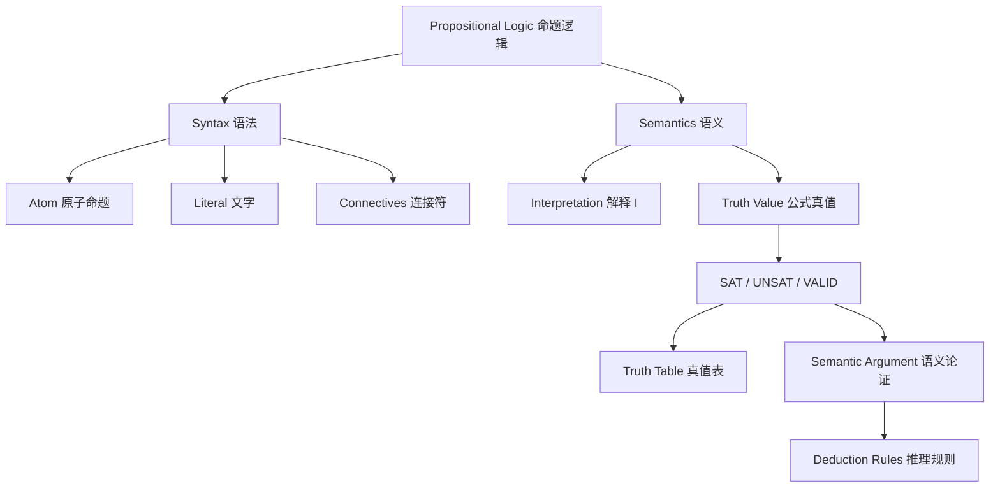

# Lec11_Propositional Logic and SAT(Part 1)_Notes

# 零-知识地图

------

## 一、Syntax（语法）

### 1.1 Truth values：真值

两个真值：

$$
1 \quad \text{true，真}
$$

$$
0 \quad \text{false，假}
$$

---

### 1.2 Atom：原子命题

原子命题通常用变量表示，例如：

$$
p,q,r,s,t
$$

---

### 1.3 Literal：文字

文字是原子命题或原子命题的否定：

$$
p,\quad \lnot p,\quad q,\quad \lnot q
$$

---

### 1.4 Formula：公式

公式可以由原子命题、文字和逻辑连接符递归构成。

**常见规则：**

1. 原子命题是公式。
2. 文字是公式。
3. 如果 $F$ 和 $G$ 是公式，则下面这些也是公式：

$$
\lnot F
$$

$$
F\land G
$$

$$
F\lor G
$$

$$
F\to G
$$

$$
F\leftrightarrow G
$$

---

### 1.5 逻辑连接符

| 符号                 | 英文    | 中文            | 含义                     |
| :------------------- | :------ | :-------------- | :----------------------- |
| $\lnot F$            | not     | 非 / 否定       | $F$ 不成立               |
| $F\land G$           | and     | 与 / 合取       | $F$ 和 $G$ 都成立        |
| $F\lor G$            | or      | 或 / 析取       | $F$ 或 $G$ 至少一个成立  |
| $F\to G$             | implies | 蕴涵            | 若 $F$ 成立，则 $G$ 成立 |
| $F\leftrightarrow G$ | iff     | 等价 / 当且仅当 | $F$ 和 $G$ 真值相同      |

其中最容易误解的是**蕴涵** $F\to G$：

只有在 $F=1,G=0$ 时为假；其余情况都为真。

也就是说，“前件为假”时，整个蕴涵式默认为真。这叫 **vacuous truth，空真**。

------

## 二、Semantics（语义）

### 2.1 Interpretation：解释

设变量集合为 $V$，解释是一个映射：

$$
I:V\to\{0,1\}
$$

换言之，解释可以理解为对每个变量给出一个真假值的一组赋值。

------

### 2.2 公式在解释下求值

给定公式 $F$ 和解释 $I$，可以计算 $F$ 的真值。

如果 $F$ 在 $I$ 下为真，记作：

$$
I\models F
$$

如果 $F$ 在 $I$ 下为假，记作：

$$
I\nvDash F
$$

---

### 2.3 求值的方法

#### 2.3.1 真值表法

**否定 $\lnot F$：**

| $F$  | $\lnot F$ |
| :--: | :-------: |
|  0   |     1     |
|  1   |     0     |

**合取 $F\land G$：**

| $F$  | $G$  | $F\land G$ |
| :--: | :--: | :--------: |
|  0   |  0   |     0      |
|  0   |  1   |     0      |
|  1   |  0   |     0      |
|  1   |  1   |     1      |

**析取 $F\lor G$：**

| $F$  | $G$  | $F\lor G$ |
| :--: | :--: | :-------: |
|  0   |  0   |     0     |
|  0   |  1   |     1     |
|  1   |  0   |     1     |
|  1   |  1   |     1     |

**蕴涵 $F\to G$：**

| $F$  | $G$  | $F\to G$ |
| :--: | :--: | :------: |
|  0   |  0   |    1     |
|  0   |  1   |    1     |
|  1   |  0   |    0     |
|  1   |  1   |    1     |

**等价 $F\leftrightarrow G$**：

| $F$  | $G$  | $F\leftrightarrow G$ |
| :--: | :--: | :------------------: |
|  0   |  0   |          1           |
|  0   |  1   |          0           |
|  1   |  0   |          0           |
|  1   |  1   |          1           |

------

#### 2.3.2 形式化语义

1. **基本情况**

   对于常量：

   $$
   I\models 1
   $$

   $$
   I\not\models 0
   $$

   对于原子命题 $p$：

   $$
   I\models p \quad \text{iff} \quad I(p)=1
   $$

   $$
   I\not\models p \quad \text{iff} \quad I(p)=0
   $$

2. **归纳情况**

   - 否定：$I\models \lnot F \quad \text{iff} \quad I\not\models F$
   - 合取：$I\models F_1\land F_2 \quad \text{iff} \quad I\models F_1 \text{ and } I\models F_2$
   - 析取：$I\models F_1\lor F_2 \quad \text{iff} \quad I\models F_1 \text{ or } I\models F_2$
   - 蕴涵：$I\models F_1\to F_2 \quad \text{iff} \quad I\not\models F_1 \text{ or } I\models F_2$

   - 等价：$I\models F_1\leftrightarrow F_2 \quad \text{iff} \quad (I\models F_1 \text{ and } I\models F_2) \text{ or } (I\not\models F_1 \text{ and } I\not\models F_2)$

------

## 三、Satisfiability and Validity

### 3.1 定义

**SAT：可满足**

公式 $F$ 是 SAT 的，当且仅当存在至少一个解释 $I$，使得 $F$ 为真：

$\exists I,\ I\models F$

**直观理解：至少有一种变量赋值能让公式成立。**

------

**UNSAT：不可满足**

公式 $F$ 是 UNSAT 的，当且仅当不存在任何解释能让 $F$ 为真：

$\forall I,\ I\not\models F$

**直观理解：无论怎么赋值，公式都为假。**

------

**VALID：有效 / 永真**

公式 $F$ 是 VALID 的，当且仅当所有解释都满足它：

$\forall I,\ I\models F$

**直观理解：无论怎么赋值，公式都为真。**

------

**总结：**

- VALID 一定 SAT，SAT 不一定 VALID。
- UNSAT 一定不是 SAT。

------

### 3.2 SAT 与 VALID 的对偶性

$F\text{ is valid} \quad \text{iff} \quad \lnot F\text{ is unsatisfiable}$

**也就是说：要证明 $F$ 永真，可以证明 $\lnot F$ 不可满足。**

------

### 3.3 判断可满足性：两种基本方法

1. **Truth table，真值表**  
   本质是搜索，枚举所有解释。

2. **Semantic argument，语义论证**  
   本质是演绎推理，根据语义规则对公式进行变形和分支推导。

现代 SAT solver 同时结合了两种方法。

------

## 四、Semantic Argument（语义论证）

真值表法这里不再介绍。它简单直接，通过枚举每种解释求出公式真值，从而得到可满足性。但是，考虑包含 $n$ 个变量的公式 $F$，真值表法需要枚举 $2^n$ 种解释，如果变量太多代价可能很高。

### 4.1 基本思想

例如，目标是证明一个公式 $F$ 是 VALID 的。

我们用反证法：

1. 假设 $F$ 不是 valid 的，则存在某个解释 $I$，使得 $I\not\models F$。
2. 从 $I\not\models F$ 出发，反复应用推理规则。
3. 如果每一个推理分支都导出矛盾，说明这样的 $I$ 不存在。
4. 因此 $F$ valid。

------

### 4.2 Deduction Rules：推理规则

#### 4.2.1 定义

**推理规则**是一种逻辑形式，可以看作一个函数：它接收若干个**前提**，分析这些前提的**语法结构**，然后返回一个**结论**。

可以写作：

$$
\frac{\text{premise}_1,\ \text{premise}_2,\ \cdots,\ \text{premise}_n}{\text{conclusion}}
$$

意思是：如果上面的前提都成立，那么可以推出下面的结论。

------

#### 4.2.2 常用推理规则

记号说明：

- $;$ 表示需要同时满足。
- $\mid$ 表示需要分支讨论。
- $\bot$ 表示矛盾，即该分支不可满足。

1. **否定规则**

由语义定义：

$$
I\models \lnot F \quad \text{iff} \quad I\not\models F
$$

可得：

$$
\frac{I\models \lnot F}{I\not\models F}
$$

$$
\frac{I\not\models \lnot F}{I\models F}
$$

2. **合取规则：$F\land G$**

合取为真时，两边都必须为真：

$$
\frac{I\models F\land G}{I\models F \quad ; \quad I\models G}
$$

合取为假时，至少一边为假，因此需要分支：

$$
\frac{I\not\models F\land G}{I\not\models F \mid I\not\models G}
$$

3. **析取规则：$F\lor G$**

析取为真时，至少一边为真，因此需要分支：

$$
\frac{I\models F\lor G}{I\models F \mid I\models G}
$$

析取为假时，两边都必须为假：

$$
\frac{I\not\models F\lor G}{I\not\models F \quad ; \quad I\not\models G}
$$

4. **蕴涵规则：$F\to G$**

因为：

$$
F\to G \equiv \lnot F\lor G
$$

所以蕴涵为真时，有两种可能：前件假，或者后件真。

$$
\frac{I\models F\to G}{I\not\models F \mid I\models G}
$$

蕴涵为假时，唯一可能是：前件真，后件假。

$$
\frac{I\not\models F\to G}{I\models F \quad ; \quad I\not\models G}
$$

5. **等价规则：$F\leftrightarrow G$**

等价为真时，两边同真或同假：

$$
\frac{I\models F\leftrightarrow G}
{(I\models F,\ I\models G) \mid (I\not\models F,\ I\not\models G)}
$$

等价为假时，两边一真一假：

$$
\frac{I\not\models F\leftrightarrow G}
{(I\models F,\ I\not\models G) \mid (I\not\models F,\ I\models G)}
$$

6. **矛盾规则**

如果同一分支中同时出现：

$$
I\models F
$$

和

$$
I\not\models F
$$

则该分支矛盾，记为：

$$
\frac{I\models F \quad I\not\models F}{\bot}
$$

其中 $\bot$ 表示 contradiction，即矛盾。

------

### 4.3 例子

证明：$F:(p\land q)\to(p\lor\lnot q)$ 是 VALID。

反证，假设存在解释 $I$，使得：

$$
I\not\models (p\land q)\to(p\lor\lnot q)
$$

由蕴涵为假：

$$
I\models p\land q
\quad ; \quad
I\not\models p\lor\lnot q
$$

由合取为真：

$$
I\models p
\quad ; \quad
I\models q
$$

由析取为假：

$$
I\not\models p
\quad ; \quad
I\not\models \lnot q
$$

由否定规则：

$$
I\models q
$$

于是同一分支中同时出现：

$$
I\models p
\quad \text{and} \quad
I\not\models p
$$

矛盾！

因此不存在解释 $I$ 使得 $F$ 为假，所以 $(p\land q)\to(p\lor\lnot q)$ 是 VALID。

------

## 五、语义上的Equivalence and Implication（等价和蕴含）

$F_1 \leftrightarrow F_2$、$F_1 \to F_2$ 都是**公式**。

我们需要给定一个解释 $I$，才能判断它们的真值。

------

### 5.1 语义等价

如果 $F_1 \leftrightarrow F_2$ 是 valid，也就是对所有解释都为真，那么我们有 $F_1 \text{ is equivalent to } F_2$ ，即 $F_1 \Leftrightarrow F_2$ 。

意思是：$F_1 \text{ 和 } F_2 \text{ 在所有解释下真值完全相同}$  

**注意：**

- $F_1 \Leftrightarrow F_2$ **不是命题逻辑中的公式**，而是两个公式之间的**语义关系**。它不依赖于某一个具体解释，而是要求对**所有解释**都成立。
- 等价的公式具有相同的 validity 和 satisfiability 。

**总结：**

- $F_1 \leftrightarrow F_2$ 是一个公式，需要在某个解释 $I$ 下判断真假。
- $F_1 \Leftrightarrow F_2$ 表示两个公式语义等价，是公式之间的关系。

------

### 5.2 语义蕴涵

类似地，可以定义语义蕴涵 $F_1\Rightarrow F_2$ ：

$$
F_1\Rightarrow F_2
\quad \text{iff} \quad
F_1\to F_2 \text{ is valid}
$$

其含义是：对所有解释，只要 $F_1$ 为真，$F_2$ 必为真。
